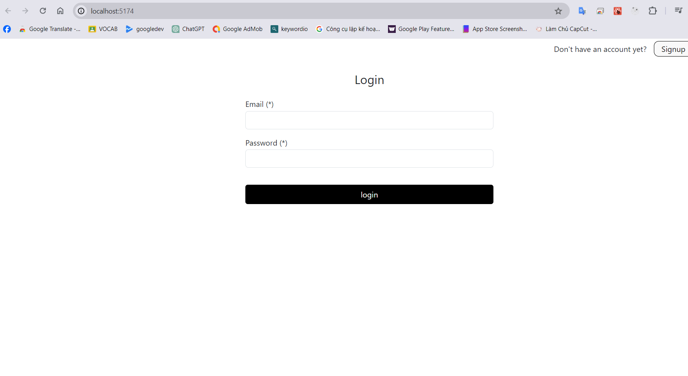
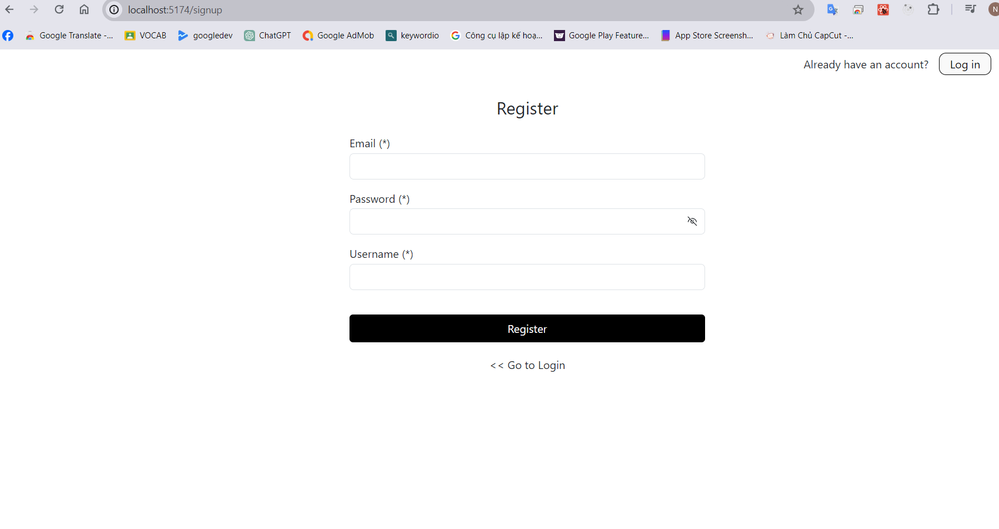
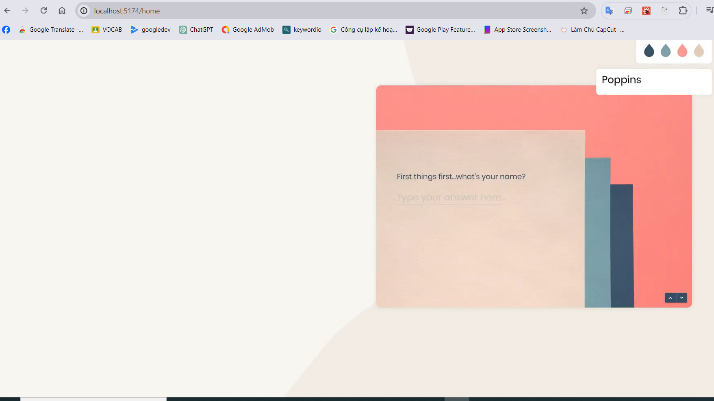

# Hướng dẫn run dự án FRONT-END

- cd Test
- npm install để khởi động node_modules
===> khởi chạy dự án: npm run dev
================================================================
- Giao diện login: 
- Giao diện register: 
- Giao diện khi login thành công: 